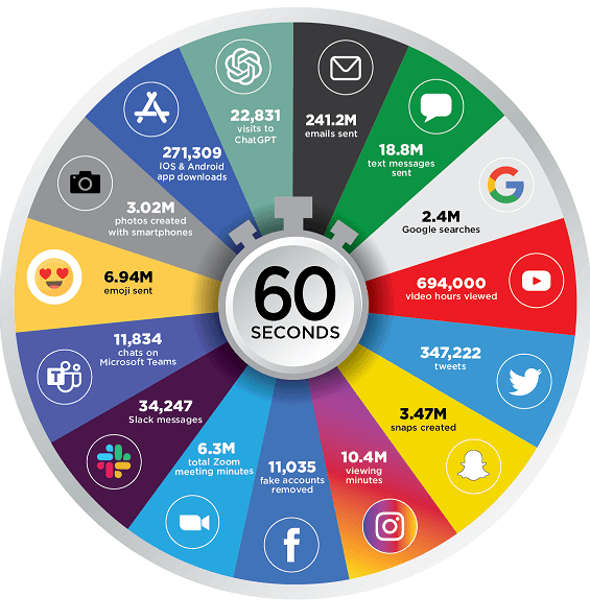
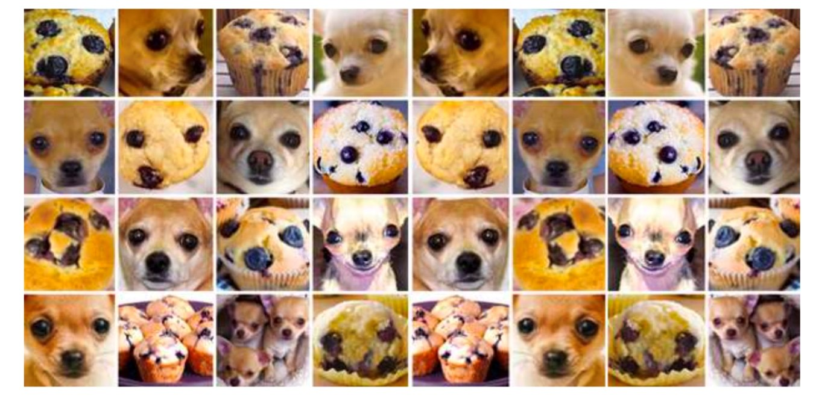
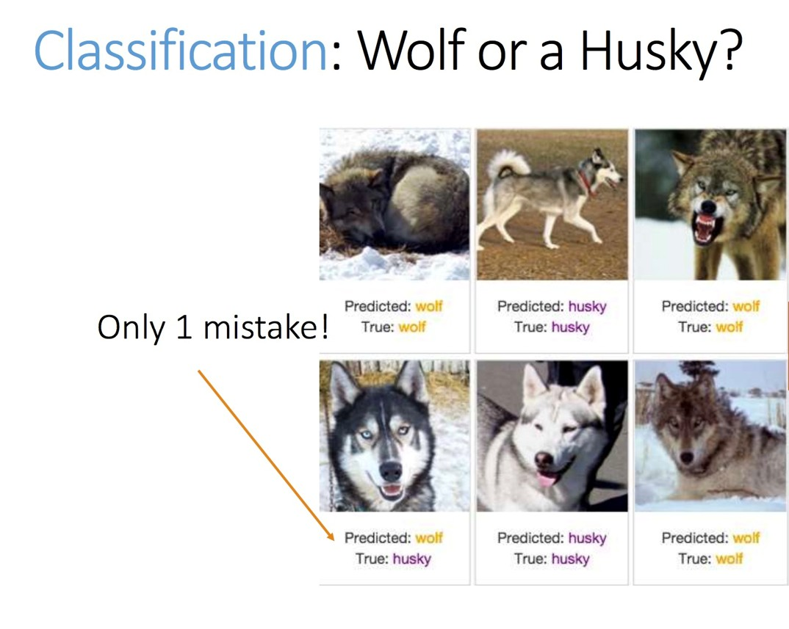
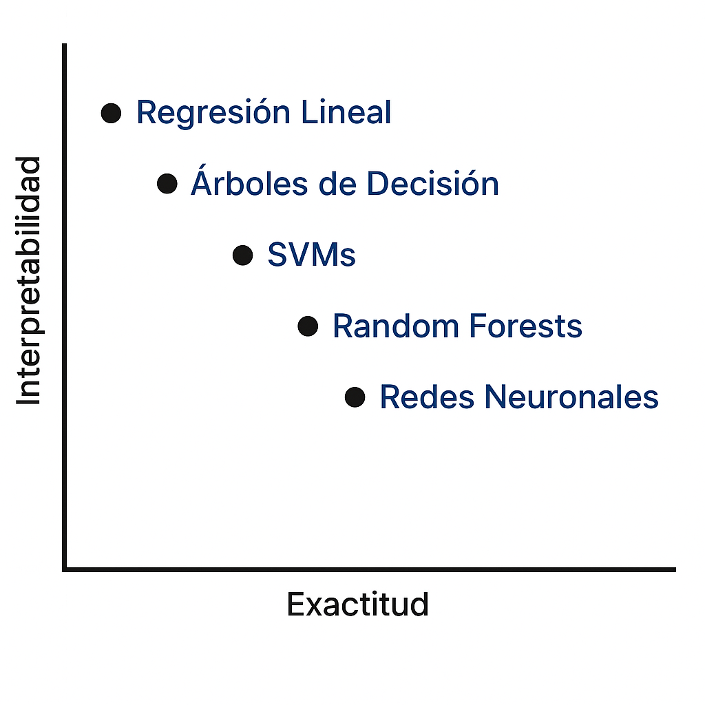
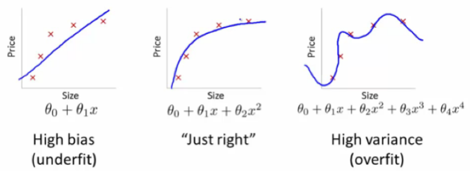
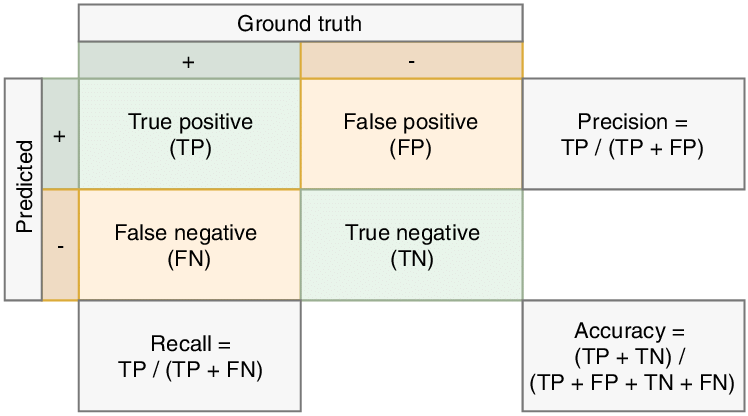
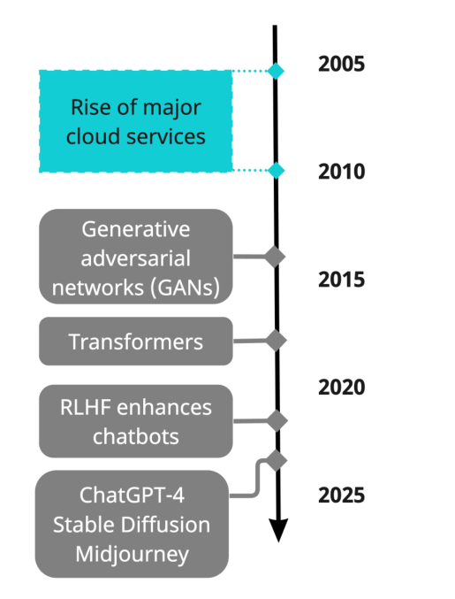
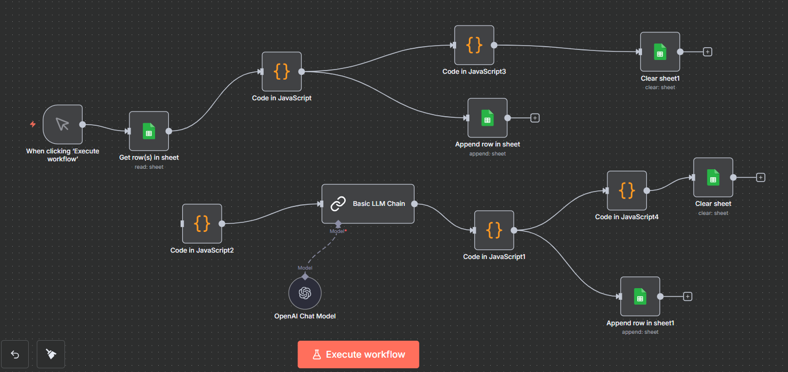
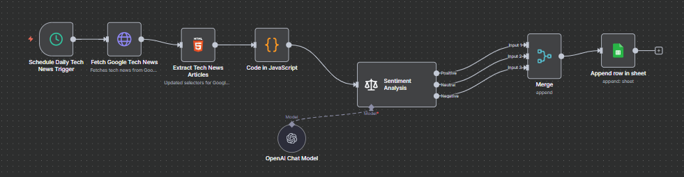

```{r load_packages, message=FALSE, warning=FALSE, include=FALSE}
library(fontawesome)
library(tidyverse)
library(knitr)
```

# Enlaces

-   `r fa("message", fill = "steelblue")` segana\@fen.uchile.cl
-   `r fa("computer", fill = "steelblue")` <https://segana.netlify.app>
-   `r fa("linkedin", fill = "steelblue")` <https://www.linkedin.com/in/sebastian-egana-santibanez/>
-   `r fa("github", fill = "steelblue")` <https://github.com/sebaegana>

---

# Contexto y motivación

---

## Contexto actual

- El volumen global de datos crece a más de **40% anual** (IDC, 2024).
- Sin embargo, solo ~**30%** de las empresas afirma ser realmente *data-driven* (McKinsey, 2023).
- El valor no está en acumular datos, sino en **transformarlos en decisiones**.
- La complejidad actual exige modelos predictivos, arquitecturas modernas
  y procesos guiados por evidencia.

---

{width="90%" fig-align="center"}

---

## Rol de la IA

:::tiny

- La IA permite **extraer patrones, predecir comportamientos y automatizar decisiones**.
- Integra datos estructurados y no estructurados  
  (texto, audio, imágenes, PDFs, transacciones, logs).
- Los modelos actuales (ML + LLMs) permiten:
  - Extraer señales desde fuentes no tradicionales.
  - Recuperar + generar contenido (RAG).
  - Acelerar la **velocidad y calidad** de las decisiones.
- Objetivo central: **reducir incertidumbre** y mejorar resultados.

:::

---

## ¿Por qué es difícil ser data-driven?

:::tiny

- No es un problema técnico: es un problema **organizacional y cultural**.
- Obstáculos frecuentes:
  - Datos dispersos, desordenados o sin gobierno.
  - Falta de claridad en la decisión que se quiere mejorar.
  - Poca alineación entre áreas (TI, riesgo, operaciones, finanzas).
  - Sesgos humanos que dominan la toma de decisiones.
  - Baja adopción de modelos por parte del negocio.
- Conclusión: ser data-driven requiere **procesos, cultura y diseño**, no solo modelos.

:::

---

# Decision science

---

## Instituciones basadas en datos

:::tiny

La diferencia entre decisiones **intuitivas** y decisiones **basadas en datos** es crítica.

Ejemplo cotidiano:

Elegir entre dos ofertas laborales (mayor salario vs. mejor calidad de vida).  
Podemos decidir por instinto o mediante una **evaluación sistemática** de factores.

Una organización data-driven hace lo mismo:

- define el problema
- recopila evidencia
- evalúa escenarios
- elige la opción con **mayor retorno esperado**
- reduce el espacio de incertidumbre

Este es el territorio de **Decision Science**.

:::

---

## ¿Qué es Decision Science?

:::tiny

La *Decision Science* es el campo interdisciplinario que:

- Combina estadística, economía, psicología, modelos computacionales y negocio.
- Crea procesos estructurados para **mejorar decisiones bajo incertidumbre**.
- Traduce datos + modelos en **acciones concretas** que generan impacto.
- Permite diseñar decisiones que sean:
  - informadas,
  - repetibles,
  - medibles,
  - alineadas a objetivos estratégicos.

**Idea clave:**  
Los datos no toman decisiones, las decisiones se diseñan.

:::

---

## Ejemplo cotidiano de decisión

Considera dos opciones:

- **Oferta A:** mayor salario, pero requiere relocalización.  
- **Oferta B:** menor salario, pero mejor equilibrio vida/trabajo.

---

¿Cómo decides?

Puedes:

::: columns

::: column
:::tiny
🧠 Decisión intuitiva: Una decisión tomada desde el instinto: rápida, emocional, y dependiente de cómo te sientes en ese momento. No requiere estructura, pero puede ser difícil de justificar o repetir.
:::
:::

::: column

:::tiny
📊 Decisión estructurada: Una decisión diseñada: define claramente qué factores importan (salario, familia, transporte, salud) y cómo se relacionan entre sí.  
Permite comparar escenarios, pensar en los riesgos y visualizar los compromisos que implica cada alternativa.
:::

:::

:::

Esto mismo escala al mundo financiero: aprobar un crédito, fijar un precio, asignar un portafolio. Todo requiere **criterios**, **escenarios**, **riesgo**, **datos**.

---

## Sesgos más allá de los datos

Incluso con modelos y datos perfectos, los seres humanos tenemos sesgos que afectan la decisión:

- **Confirmation bias:** buscamos información que confirma lo que creemos.
- **Anchoring bias:** nos quedamos anclados a un valor inicial (ej.: precio en un “cyber”).
- **Loss aversion:** perder duele más que ganar lo mismo.
- **Availability heuristic:** sobreestimamos eventos fáciles de recordar (accidentes aéreos).

---

Estos sesgos están presentes en:

- decisiones de riesgo
- inversiones
- evaluación de campañas
- aprobación de créditos

**Decision Science** busca mitigarlos mediante procesos estructurados.

---

## Sobre la racionalidad limitada

La teoría asume decisiones racionales:  

- información completa
- tiempo infinito
- sin emociones
- sin sesgos

---

La realidad es distinta:

1. **Tenemos límites cognitivos.**  
2. **Disponemos de información incompleta.**  
3. **Operamos bajo presión de tiempo.**  
4. **Emociones y riesgo percibido influyen.**

Por eso la toma de decisiones ocurre en un contexto de **racionalidad limitada**, donde los modelos y los datos ayudan a compensar nuestras limitaciones.

---

## El método científico como base

El método científico propone un ciclo estructurado:

1. **Observación**  
2. **Planteamiento de hipótesis**  
3. **Experimentación / Medición**  
4. **Análisis de resultados**  
5. **Conclusión**

---

En Decision Science este ciclo se aplica a decisiones:

- Las hipótesis = propuestas de acción.  
- Los experimentos = pilotos, A/B testing, simulaciones.  
- El análisis = evidencia cuantitativa sobre qué funciona.  

No se trata de “tener razón”, sino de **aprender**.

---

## Toda decisión es una predicción

Cada decisión —en salud, finanzas o negocios— implica una predicción:

- Aprobar un crédito → predicción de pago/no pago.  
- Determinar un precio → predicción de demanda.  
- Asignar un portafolio → predicción de retornos y riesgos.  
- Aceptar un trabajo → predicción de bienestar futuro.

---

Una buena decisión requiere:

- datos
- modelos
- escenarios
- estimar incertidumbre
- medir impacto

**El reto no es decidir, sino predecir mejor.** Y hacerlo de forma **sistemática**.

---

# Framework organizacional

---

## Framework de trabajo

El enfoque de **Decision Science** propone un ciclo sistemático:

1. **Definir el problema**  
   - ¿Qué decisión queremos mejorar?
   - ¿Qué significa “éxito” para negocio/riesgo/operaciones?

2. **Reunir y analizar datos**  
   - Fuentes internas y externas.
   - Calidad, disponibilidad, relevancia.
   - Primeras señales y patrones.


---

3. **Desarrollar y evaluar alternativas**  
   - Distintos modelos, escenarios, políticas, precios.
   - ¿Qué ocurre si…?

4. **Seleccionar e implementar soluciones**  
   - La alternativa con mejor relación riesgo-retorno.
   - Integración al flujo productivo.
   - Medición de impacto real.

> Este ciclo convierte datos → modelos → decisiones → resultados.


---

## The Decision Stack

:::tiny

Para que los datos generen impacto, se debe comenzar **arriba**, en la decisión:

1. **Decision**  
   - ¿Qué decisión específica vamos a mejorar?

2. **Objective**  
   - ¿Qué significa “mejor”?  
   - ¿Mayor retorno? ¿Menor riesgo? ¿Mayor conversión?

3. **Alternatives**  
   - Distintas políticas, reglas, modelos, precios.

:::

---

:::tiny

4. **Uncertainty**  
   - ¿Qué no sabemos?  
   - ¿Cómo lo cuantificamos?

5. **Models**  
   - Herramientas para reducir incertidumbre.

6. **Data**  
   - Datos como insumo, no como punto de partida.

7. **Action**  
   - Implementación y monitoreo.

**Idea clave:**  
Los proyectos exitosos empiezan por la **decisión**, no por los datos.

:::

---

## Triaging y calidad de datos

Debemos partir por priorizar qué datos vale la pena usar, limpiar es integrar antes del proceso de analítico:

**¿Qué datos importan realmente?**

- ¿Son relevantes para la decisión?
- ¿Representan el comportamiento actual?
- ¿Se pueden usar legal y operacionalmente?

---

**Chequeos de calidad**

- Porcentaje de valores perdidos (missingness).
- Rango válido de variables (edad, ingresos, tasas).
- Detección de outliers.
- Actualización y frescura de los datos.

---

**Triaging (priorización)**

- No todos los datos valen la pena.
- La clave es priorizar los datos con:

  - impacto potencial
  - disponibilidad
  - costo razonable
  - alineación con la decisión

> Buenos datos → buenos modelos → mejores decisiones.

---

## ¿Por qué fallan los proyectos data-driven?

:::tiny

Las causas más comunes:


| Problema                           | Descripción                                                |
|------------------------------------|------------------------------------------------------------|
| Problema mal definido              | Modelo construido sin una decisión clara asociada         |
| Métricas de éxito poco claras      | Éxito técnico no coincide con el éxito de negocio         |
| Mala calidad de datos              | Datos desordenados, incompletos o irrelevantes            |
| Desconexión entre negocio y analytics | Poco buy-in, alineación débil, expectativas poco realistas |
| Modelos que no se implementan      | Quedan en notebooks y no llegan a producción              |
| Falta de cultura de experimentación | Decisiones que se toman “por costumbre”, sin evidencia    |

**Regla de oro:** Un buen modelo vale cero si no cambia decisiones reales.

:::

---

## Fundamentos estadísticos esenciales

Conceptos clave:

- Tendencia central (media, mediana, moda)
- Dispersión (varianza, desviación estándar)
- Correlaciones entre variables
- Incertidumbre y variabilidad

**Idea central:**  
La estadística no busca certezas, sino **cuantificar incertidumbre** para tomar mejores decisiones.

---

## Medidas de éxito

Un proyecto de datos no es exitoso solo porque “el modelo funciona”. Antes de comenzar, se deben acordar **criterios de éxito**:

**Desempeño técnico**

- Accuracy, AUC, precision, recall, MAE, RMSE.
- ¿Qué métrica importa para la decisión?

**Tiempo**

- ¿Llegó el modelo cuando el negocio lo necesitaba?

---

**Costo**

- Eficiencia de recursos, infraestructura, licencias, horas hombre.

**Calidad**

- Reproducibilidad, claridad del código, documentación.

**Impacto en el negocio**

- Rentabilidad, reducción de riesgo, eficiencia operacional.

> Un modelo sin impacto es solo un análisis interesante.

---

## Promedio, varianza y correlación

**Promedio (media)**: Representa el “centro” de los datos.  

**Varianza / Desviación estándar**: Miden la variabilidad.  

**Correlación**: Indica si dos variables se mueven juntas.  

⚠️ **Cuidado:**

Correlación no implica causalidad. Que dos series se muevan juntas no significa que una cause la otra.

---

## Utilización de datos

---

### Jack Maple y COMPSTAT Center


---

### Tiempo promedio de hospitalización

En un caso simple, podríamos pensar en el promedio de días que pasa cada paciente por alguna patología en particular.

Tenemos los siguientes datos de altas de pacientes con neumonía y queremos predecir el tiempo promedio de hospitalización en días:

```{r message=FALSE, warning=FALSE}
#| eval: false
#| include: true
#| echo: true

tiempo <- c(2,3,1,5,7,8,9,3,4,6,2,10,11,7,5,4,12,8,9,6)
alta   <- c(1,1,1,1,1,0,0,1,1,1,1,0,0,1,1,1,0,1,1,1)

```

Acá la censura corresponde a los pacientes que no han sido dados de alta (alta = 0).

---

:::tiny
```{r message=FALSE, warning=FALSE}
#| eval: true
#| include: true
#| echo: false

tiempo <- c(2,3,1,5,7,8,9,3,4,6,2,10,11,7,5,4,12,8,9,6)
alta   <- c(1,1,1,1,1,0,0,1,1,1,1,0,0,1,1,1,0,1,1,1)

df <- tibble(TCC = tiempo, DELTA = alta)

units_label <- "días"

# --- Conteos clave ---
n_total    <- nrow(df)
n_event    <- sum(df$DELTA == 1)
n_censored <- sum(df$DELTA == 0)
event_rate <- n_event / n_total

kable(
  data.frame(
    Total = n_total,
    Eventos_DELTA1 = n_event,
    Censuras_DELTA0 = n_censored,
    Proporcion_evento = round(event_rate, 3)
  ),
  caption = "Conteos: total, eventos (DELTA=1), censuras (DELTA=0)"
)

# --- Resumen estadístico (global y por estado) ---
quant_levels <- c(0, .1, .25, .5, .75, .9, 1)
qnames <- paste0("q", quant_levels*100)

resumen_global <- df %>%
  summarise(
    n     = n(),
    min   = min(TCC),
    mean  = mean(TCC),
    mean_obs = mean(TCC[DELTA == 1]),  # promedio solo con casos observados
    sd    = sd(TCC),
    median= median(TCC),
    max   = max(TCC),
  )


kable(resumen_global, digits = 3,
      caption = paste("Resumen global de TCC (", units_label, ")", sep=""))

```
:::

---

Veamos el análisis de Weibull para estos datos:

:::tiny
```{r message=FALSE, warning=FALSE}
#| eval: true
#| include: true
#| echo: false

library(survival)
library(fitdistrplus)

# -----------------------------
# Ajuste CON censura (único caso)
# -----------------------------
ajuste <- survreg(Surv(TCC, DELTA) ~ 1, dist = "weibull", data = df)

mu_hat <- as.numeric(coef(ajuste))  # intercepto en la escala log-tiempo
sig    <- ajuste$scale              # σ (escala AFT)

# Conversión a Weibull 2P "clásico": f(t) = (k/λ) (t/λ)^{k-1} exp(-(t/λ)^k)
k_c   <- 1 / sig                    # shape
lam_c <- exp(mu_hat)                # scale

# -----------------------------
# Funciones resumen Weibull
# -----------------------------
w_tp   <- function(p, k, lam) lam * (-log(1 - p))^(1 / k)
w_med  <- function(k, lam)   lam * (log(2))^(1 / k)
w_mean <- function(k, lam)   lam * gamma(1 + 1 / k)

# -----------------------------
# Tablas (solo kable)
# -----------------------------
params_tbl <- tibble::tibble(
  Caso       = "Con censura",
  `shape (k)` = round(k_c, 4),
  `scale (λ)` = round(lam_c, 4)
)

summ_tbl <- tibble::tibble(
  Caso    = "Con censura",
  Mediana = w_med(k_c, lam_c),
  Media   = w_mean(k_c, lam_c),
  `p=0.1` = w_tp(0.1, k_c, lam_c),
  `p=0.5` = w_tp(0.5, k_c, lam_c),
  `p=0.9` = w_tp(0.9, k_c, lam_c)
) |> dplyr::mutate(dplyr::across(where(is.numeric), ~ round(., 4)))

kable(params_tbl, booktabs = TRUE,
      caption = "Parámetros Weibull 2P")

kable(summ_tbl, booktabs = TRUE,
      caption = "Mediana, media y percentiles t_p (p=0.1, 0.5, 0.9)")

```
:::

---

## LATAM Airlines Group (LTM.SN)

```{r, message=FALSE, warning=FALSE, echo=FALSE}
#| fig.show: hold
#| layout-ncol: 3

library(tidyquant)
library(tidyverse)
library(scales)
library(ggplot2)

ticker <- "LTM.SN"          

# --------- 1) Ventana larga: 2018–actualidad ---------
desde1 <- "2018-01-01"
hasta1 <- Sys.Date()

precios1 <- tq_get(ticker, from = desde1, to = hasta1)

ultimo1 <- precios1 |> 
  slice_tail(n = 1) |> 
  pull(adjusted)

promedio1 <- mean(precios1$adjusted, na.rm = TRUE)

p1 <- ggplot(precios1, aes(date, adjusted)) +
  geom_line(linewidth = 0.8, color = "steelblue") +
  geom_hline(yintercept = promedio1, linetype = "dashed", color = "red") +
  annotate("text", x = min(precios1$date), y = promedio1,
           label = paste0("Promedio: $", round(promedio1, 0)),
           hjust = 0, vjust = -1, color = "red", size = 3) +
  labs(
    title = "2018–actualidad",
    subtitle = paste0("Último cierre: ",
                      label_dollar(prefix = "$", big.mark = ".", decimal.mark = ",")(ultimo1),
                      " CLP (", max(precios1$date), ")"),
    x = "Fecha", 
    y = "Precio ajustado (CLP)"
  ) +
  theme_minimal(base_size = 9)

# --------- 2) Ventana Covid: 2020–2021 ---------
desde2 <- "2020-01-01"
hasta2 <- "2021-12-31"

precios2 <- tq_get(ticker, from = desde2, to = hasta2)

ultimo2 <- precios2 |> 
  slice_tail(n = 1) |> 
  pull(adjusted)

promedio2 <- mean(precios2$adjusted, na.rm = TRUE)

p2 <- ggplot(precios2, aes(date, adjusted)) +
  geom_line(linewidth = 0.8, color = "steelblue") +
  geom_hline(yintercept = promedio2, linetype = "dashed", color = "red") +
  annotate("text", x = min(precios2$date), y = promedio2,
           label = paste0("Promedio: $", round(promedio2, 0)),
           hjust = 0, vjust = -1, color = "red", size = 3) +
  labs(
    title = "Ventana 2020–2021",
    x = "Fecha", 
    y = "Precio ajustado (CLP)"
  ) +
  theme_minimal(base_size = 9)

# --------- 3) Ventana reciente: 2024–2025 ---------
desde3 <- "2024-01-01"
hasta3 <- "2025-09-26"

precios3 <- tq_get(ticker, from = desde3, to = hasta3)

ultimo3 <- precios3 |> 
  slice_tail(n = 1) |> 
  pull(adjusted)

promedio3 <- mean(precios3$adjusted, na.rm = TRUE)

p3 <- ggplot(precios3, aes(date, adjusted)) +
  geom_line(linewidth = 0.8, color = "steelblue") +
  geom_hline(yintercept = promedio3, linetype = "dashed", color = "red") +
  annotate("text", x = min(precios3$date), y = promedio3,
           label = paste0("Promedio: $", round(promedio3, 0)),
           hjust = 0, vjust = -1, color = "red", size = 3) +
  labs(
    title = "Ventana 2024–2025",
    x = "Fecha", 
    y = "Precio ajustado (CLP)"
  ) +
  theme_minimal(base_size = 9)

```


```{r, echo=FALSE}
p1
```

---

```{r, echo=FALSE}

p2
```

---

```{r, echo=FALSE}

p3
```

---

# Machine Learning en la práctica  

---

## ¿Cómo se hace ML en la práctica?

:::tiny
1. Hacer una pregunta  
2. Recolectar y explorar datos  
3. Limpiar y transformar atributos  
4. Seleccionar algoritmos  
5. Entrenar modelos  
6. Evaluar resultados  
7. Usar las respuestas  
:::

---

## Precauciones clave

- **Umbrales de decisión importan más que la accuracy**  
- La matriz de confusión define *lo que cuesta equivocarse*  
- Decisiones deben basarse en **beneficios y costos reales**, no en métricas abstractas 
- **Regulación**: crédito, salud, seguros → modelos deben ser explicables

---

## Error Tipo I vs Tipo II

:::columns
:::column
**Falso Positivo (Tipo I)**  
- Detecta algo que *no está*  
- “¡Está embarazado!” (cuando no lo está)

{width="40%" fig-align="center"}

:::

:::column
**Falso Negativo (Tipo II)**  
- No detecta algo que *sí está*  
- “No está embarazada” (cuando sí lo está)

{width="40%" fig-align="center"}

:::
:::

---

## Chihuahua o Cupcake 🐶🧁

{width="70%" fig-align="center"}

:::tiny
Algunos patrones visuales engañan tanto a humanos como a modelos.  
Lo “obvio” no siempre es obvio.  
:::

---

{width="100%" fig-align="center"}

---

## Detector de nieve ❄️😠

{width="70%" fig-align="center"}

:::tiny
Un modelo entrenado solo con “fotos nevadas” aprende a detectar *nieve*, no *perros*.  
Los sesgos del dataset se traducen en errores sistemáticos.  
:::

---

## Interpretabilidad vs Exactitud

{width="30%" fig-align="center"}

:::tiny
Más exactitud suele implicar menos interpretabilidad.  
La decisión depende del **riesgo**, **regulación**, y **confianza del negocio**.
:::

---

## Muestreo: Entrenamiento vs. Prueba

La división de los datos en **Train Set** y **Test Set** (típicamente 70% / 30%) es una herramienta fundamental para **evaluar la capacidad real de generalización** del modelo.

¿Qué pasa si no dividimos?

- El modelo se entrena y evalúa con los **mismos datos**.  
- Puede aprender patrones verdaderos **y también ruido**.  
- En la práctica, “parece perfecto”… pero sólo dentro de su entrenamiento.  

---

¿Qué aporta el Test Set?

- Muestra cómo se comporta el modelo en **datos nunca vistos**.  
- Si el error en train es bajo pero en test es alto → **overfitting detectado**.  
- Si ambos errores son similares → el modelo está “just right”.


---

{width="10%" fig-align="center"}


:::tiny

| Imagen | Interpretación | Conexión con Train/Test |
|-------|---------------|---------------------------|
| **High bias / underfit** | Modelo demasiado simple | Alto error en train y test |
| **Just right** | Generaliza bien | Errores similares y bajos |
| **High variance / overfit**  | Memoriza ruido | Train muy bueno, Test muy malo |

:::

---

🧠 Idea clave

> **El Test Set es un muestreo independiente que nos alerta cuando el modelo se está sobreadaptando.**  
> Sin él, nunca veríamos la diferencia entre “just right” y “overfit”.


---

## Machine Learning no siempre es accionable

> “Esencialmente, todos los modelos están equivocados… algunos sirven.”  
> — G.E.P. Box

No todo modelo genera impacto:

- puede no implementarse
- puede no ser interpretable
- puede ser demasiado caro 
- puede ser poco confiable

---

# Incertidumbre y modelos

---

## Incertidumbre y confianza

::: panel-tabset

## Medir incertidumbre

:::tiny
En análisis de datos, la incertidumbre **no se elimina**, se **cuantifica**.

- Toda predicción tiene un rango posible de resultados.
- Usamos:

  - intervalos de confianza
  - desviaciones estándar
  - bandas de predicción
  - distribuciones completas
  
:::

## Por qué importa

:::tiny 
- Una decisión robusta no se basa solo en “el número esperado”.
- Se basa en entender:

  - qué tan incierto es el resultado
  - qué tan sensible es a los supuestos
  - qué tan grave es un error de predicción
  
> La confianza no proviene de la certeza, sino de entender el riesgo.

:::

:::

---

## Simulaciones de Monte Carlo

Una simulación busca reproducir **posibles futuros** bajo incertidumbre.

::: panel-tabset

## ¿Cómo funciona?

- Se define un modelo (ventas, precios, costos, retornos…)
- Se asignan distribuciones a las variables inciertas.
- Se generan miles de escenarios con muestreo aleatorio.
- Se obtiene una distribución de resultados.

## ¿Para qué sirve?

- Evaluar riesgo y probabilidad de pérdidas.
- Analizar sensibilidad del negocio.
- Comparar alternativas bajo incertidumbre.
- Comprender “colas” y eventos extremos.

:::

> No predice un futuro, sino **miles de futuros posibles**.

---

## Tipos de modelos

::: panel-tabset

### **Modelos de regresión**

- Variable objetivo: numérica/continua
- Ejemplos:
  - predicción de precio de activo
  - forecasting de demanda
  - estimación de ingresos

### **Modelos de clasificación**

- Variable objetivo: categórica/discreta
- Ejemplos:
  - default vs. no default
  - fraude vs. no fraude
  - churn vs. no churn

### **Clustering (no supervisado)**

- Identifica grupos o patrones sin etiquetas
- Ejemplos:

  - segmentación de clientes
  - patrones de comportamiento transaccional

:::


---

## Métricas de modelos

::: panel-tabset

### **Clasificación**

:::tiny

| Métrica      | Descripción |
|--------------|-------------|
| **Accuracy** | Proporción de aciertos totales. |
| **Precision** | Proporción de los predichos positivos que eran realmente positivos. |
| **Recall** | Proporción de los verdaderos positivos que fueron correctamente detectados. |
| **F1 Score** | Media armónica entre precision y recall; balancea ambos. |
| **AUC-ROC** | Capacidad global del modelo para discriminar entre clases (área bajo la curva ROC). |

:::

### **Regresión**

| Métrica | Descripción |
|--------|-------------|
| **MAE** | Error absoluto promedio. |
| **RMSE** | Penaliza más los errores grandes. |
| **MAPE** | Error porcentual promedio. |
| **R²** | Varianza explicada (no siempre es una buena métrica). |

:::

---

## Matriz de confusión

La matriz de confusión resume el desempeño de un modelo de clasificación:

- **TP:** verdaderos positivos  
- **FP:** falsos positivos  
- **FN:** falsos negativos  
- **TN:** verdaderos negativos  

> Elegir la métrica correcta depende del costo del error.

---

{width="90%" fig-align="center"}

[Revisar](https://developers.google.com/machine-learning/crash-course/classification/accuracy-precision-recall?hl=es-419)

---

## En detalle


- La **precision** importa cuando un falso positivo es muy costoso.

- El **recall** importa cuando un falso negativo es lo más grave.

--- 

## Ejemplos

::: panel-tabset

### Churn

:::tiny

| Etapa                                       | Error más costoso | Métrica clave | Explicación                                                    |
|---------------------------------------------|-------------------|---------------|----------------------------------------------------------------|
| **Screening de churn**                      | Falso Negativo    | **Recall**    | Perder un cliente real suele ser muy costoso para el negocio. |
| **Intervención costosa (beneficios/bonos)** | Falso Positivo    | **Precision** | No quieres gastar recursos en clientes que igual se quedarían. |

:::

### Salud

:::tiny

| Enfermedad | Etapa             | Error más costoso | Métrica clave | Explicación                                             |
|------------|-------------------|-------------------|---------------|---------------------------------------------------------|
| **Cáncer** | Detección inicial | Falso Negativo    | **Recall**    | Dejar sin detectar un cáncer puede costar la vida.      |
| **VIH**    | Screening inicial | Falso Negativo    | **Recall**    | No detectar un caso aumenta contagio y agrava la salud. |
| **VIH**    | Confirmatorio     | Falso Positivo    | **Precision** | Diagnóstico erróneo causa daño psicológico y social.    |

:::

:::

---

# Montecarlo aplicado a Finanzas

---

## Aplicación en evaluación de proyectos

En el caso de proyectos, podemos realizar un análisis de carácter estocástico, lo que implica asumir que alguna de las variables no es conocida pero sí que puede estar situada dentro de algunos parámetros.

- Veamos el siguiente ejemplo: Una empresa está evaluando la introducción de un nuevo producto y desea conocer la probabilidad que obtenga pérdidas. Para cumplir dicho propósito lo contrata a usted para construir un modelo financiero del negocio.

---

:::tiny

Después de realizar la debida investigación, usted decide construir una simulación de Monte Carlo que le permita generar la distribución de probabilidad de las utilidades del negocio, modelando separadamente los ingresos y los costos totales, considerando los siguientes elementos:

Por el lado de los ingresos totales, se considerarán tres escenarios (A, B y C) para el precio y la cantidad, los cuales aparecen descritos en la siguiente tabla:

| Variable     | A   | B   | C   |
|---------------|-----|-----|-----|
| **Precio**    | 12  | 13  | 16  |
| **Cantidad**  | 110 | 100 | 80  |
| **Probabilidad** | 1/4 | 1/2 | 1/4 |

:::

---

En el caso de los costos totales, los costos fijos son iguales a \$150 y los costos variables unitarios son constantes y son modelados usando una distribución triangular con los siguientes parámetros:

| Parámetro     | Valores |
|----------------|----------|
| **Valor mínimo** | 9 |
| **Valor máximo** | 13 |
| **Moda**          | 11 |

---

## Resultado

::: panel-tabset

### Código

```{r, message=FALSE, warning=FALSE, echo=TRUE}
library(tidyverse)
library(triangle)
#set.seed(1234567)

reps = 10000
utilidad = matrix(NA, nrow = reps, ncol = 1)
for (i in 1:reps) {
  x = sample(c("A","B","C"), 1, replace = TRUE, prob = c(1/4, 1/2, 1/4))
  if (x == "A") {
    precio = 12
    cantidad = 110
  }
  else if (x == "B") {
    precio = 13
    cantidad = 100
  }
  else {
    precio = 16
    cantidad = 80
  }
  costo_variable_unitario = rtriangle(1, 9, 13, 11)
  costo_fijo = 150
  utilidad[i] = (precio - costo_variable_unitario)*cantidad - costo_fijo
}

utilidad <- data.frame(utilidad)

```

### ¿Pérdidas?

```{r, message=FALSE, warning=FALSE, echo=FALSE, out.width="70%"}
ggplot(utilidad) +
  geom_histogram(aes(x = utilidad, y=after_stat(density)), col="black", bins = 35) +
  labs(x = "Utilidad", y = "Densidad") +
  theme(
    panel.background = element_blank(),
    axis.line = element_line()
  )
paste0("Prob(utilidad<0) = ", round(mean(utilidad$utilidad<0),2))
```

### Utilidades

```{r, message=FALSE, warning=FALSE, echo=FALSE}
paste0("Valor esperado utilidad = ", round(mean(utilidad$utilidad),2))

```

:::

---

# IA y Mercados financieros

---

## Hipótesis de los Mercados Eficientes

:::tiny

Los mercados financieros procesan información constantemente:  
precios, noticias, reportes, expectativas macro, señales técnicas.

La **Hipótesis de los Mercados Eficientes (EMH)** propone que los precios ya reflejan la información disponible.

Sin embargo:

- La IA puede analizar grandes volúmenes de datos
- detectar patrones no lineales,
- extraer señal de texto, imágenes y variables alternativas

¿Puede la IA “ganarle al mercado”? La respuesta depende de **qué tan eficiente sea el mercado**.

[Visitar nof1.ai](https://nof1.ai/?s=08)

:::

---

## EMH: Forma débil

:::tiny
La forma débil sostiene que:

- Los precios actuales incorporan TODA la información histórica  
  (precios, retornos, volumen).

Implicancias:

- El análisis técnico no debería generar retornos anormales persistentes.
- Los precios siguen un **random walk**.
- No existe memoria temporal útil para predecir retornos futuros.

> En la forma débil, la IA compite por micro-ineficiencias.

:::


---

## EMH: Forma semi-fuerte

:::tiny
La forma semi-fuerte sostiene que:

- Los precios incorporan **toda la información pública**, como:

  - noticias
  - reportes corporativos
  - estados financieros
  - indicadores macro

Por lo tanto:

- Ningún análisis basado en información pública debería generar alfa consistente.

> Conclusión: ventaja informacional de corto plazo, no necesariamente un alfa sostenible.

:::

---

## EMH: Forma fuerte

:::tiny

La forma fuerte sostiene que:

- Los precios reflejan TODA la información, incluso la **información privada** (insider).

Implicancias:

- Nadie podría obtener retornos superiores de forma consistente
- Incluso información privilegiada estaría incorporada en el precio
- Casi cualquier ventaja desaparecería instantáneamente

Evidencia empírica:

- Casos de insider trading demuestran que la forma fuerte NO se cumple
- Hay filtraciones, anomalías y eventos previsibles de corto plazo

> En mercados muy eficientes, la IA es más útil para “vigilar” que para “ganar”.

:::

---

## IA y eficiencia de mercado

En la práctica:

- La IA mejora la velocidad de procesamiento.
- Reduce la fricción informacional.
- Permite extraer señales de datos alternativos:

  - imágenes satelitales
  - tráfico marítimo
  - sensores
  - datos de movilidad
  - comportamiento digital

---

Pero también:

- Si todos usan IA, las ventajas se vuelven **transitorias**
- La “carrera armamentista” entre agentes reduce el alfa
- La eficiencia aumenta → el alfa disminuye

Conclusión:

La IA no garantiza ganarle al mercado, pero sí **mejora la calidad de las decisiones** en inversión, riesgo y operación.


---

# IA Generativa

---

:::tiny

## ¿Qué es la IA Generativa?

- **IA (Artificial Intelligence):** Sistemas capaces de realizar tareas que normalmente requieren inteligencia humana.

- **IA Generativa:** Modelos capaces de *crear* contenido nuevo — texto, imágenes, audio, video, código — a partir de patrones aprendidos.

- La IA generativa **predice patrones** para producir contenido original, no los copia.

IA y algoritmos:

- Los algoritmos clásicos siguen reglas fijas.  
- En IA, **las reglas son aprendidas por el modelo** y pueden mejorar con más datos.

:::

---

## Innovaciones clave en la historia de la IA

::: columns
::: column

::: tiny
1. **Cloud computing**  
   → Datos + cómputo a escala global.  

2. **GANs**  
   → Imágenes fotorrealistas.  
   [Ver ejemplo](https://thispersondoesnotexist.com)

3. **Transformers**  
   → Comprensión profunda del lenguaje.  
   [Paper original](https://arxiv.org/abs/1706.03762)

4. **RLHF**  
   → Modelos ajustados con retroalimentación humana.

5. **Midjourney / Stable Diffusion / GPT-4**  
   → Multimodalidad y creatividad avanzada.
:::

:::

::: column
{width="60%"}
:::

:::

---

## 🤖 La IA no es un modelo — es un ecosistema

Un **LLM** (GPT, Claude, Llama) es solo una parte del sistema.

Para responder una consulta compleja, se coordinan múltiples componentes:

::: tiny
- **Computer Vision:** detecta objetos/escenas en imágenes.  
- **OCR:** extrae texto de imágenes y PDFs.  
- **Speech Recognition / TTS:** transforma audio en texto y viceversa.  
- **LLM:** interpreta y genera respuestas en lenguaje natural.  
- **Orchestration Layer:** decide qué módulos usar y en qué orden.
:::

---

```{=html}
<pre style="font-size:1em; line-height:1;">
📷 Imagen ──▶ 🧠 Computer Vision
           │
           ▼
      🧾 OCR (Texto extraído)
           │
           ▼
      💬 LLM (Comprensión y respuesta)
           │
           ▼
      🧭 Respuesta contextual
</pre>
```

---

{width="100%" fig-align="center"}

---


{width="100%" fig-align="center"}


---

## ¿Qué es un LLM?

:::tiny

Un **Large Language Model** es un modelo entrenado con enormes cantidades de texto para:

- predecir la siguiente palabra,  
- generar contenido coherente,  
- comprender contextos complejos,  
- producir texto, código, explicaciones,  
- razonar de manera estadística.

Un LLM **no “entiende” el mundo**, modela patrones del lenguaje para generar la respuesta más probable.

:::

---

# Cultura de experimentación

---

## Experimentación en organizaciones

:::tiny
La experimentación es un pilar del enfoque **Decision Science**

Según Harvard Business Review:

- Las decisiones estratégicas mejoran cuando se **prueban hipótesis**
- Las organizaciones exitosas experimentan continuamente:

  - nuevos precios
  - nuevas políticas
  - nuevas interfaces
  - nuevas estrategias de riesgo
  - nuevos modelos

> Si no experimentas, **adivinas**. La evidencia supera la intuición

:::

---

## Por qué experimentamos: ejemplos ilustrativos

**Epigenética en ratones 🐭**

- Los cambios observados no se deben a mutaciones,  
  sino a modificaciones heredables de expresión genética.
- ¿Por qué usar ratones?  
  → Permiten experimentación rápida, controlada y repetible.
- Lección: para entender un sistema complejo, hay que **experimentar**.

---

## **NASA vs. SpaceX 🚀**

- NASA: diseño orientado a minimizar el riesgo antes del vuelo.  
  → Costos extremadamente altos.
- SpaceX: filosofía de **iterar rápido**, fallar barato, aprender.
  → Costo por lanzamiento ~67M vs. >4B del SLS (Space launch system).
- La innovación requiere un ciclo **prueba → error → ajuste → repetición**.

---

## Cultura test-and-learn

:::tiny

Una cultura de experimentación incluye:


| Etapa                   | Elementos clave |
|-------------------------|-----------------|
| **Hipótesis claras**    | ¿Qué queremos probar? ¿qué variable queremos mover?<br>|
| **Experimentos controlados** | Pilotos, grupos de control, pruebas A/B |
| **Medición rigurosa**   | Definir métricas antes del experimento, analizar efecto causal y no solo correlaciones |
| **Aprendizaje estructurado** | Documentar resultados, ajustar políticas y modelos |


> La experimentación convierte organizaciones rígidas en organizaciones adaptativas.

:::


