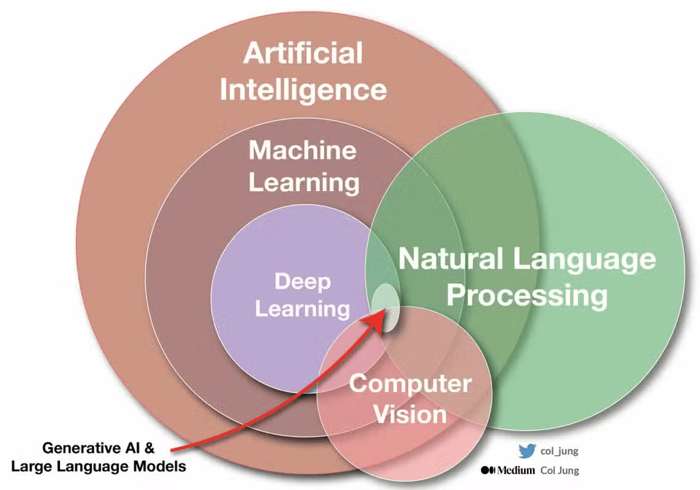

```{=html}
<style>
.smaller { font-size: 85%; }
.tiny { font-size: 70%; }
</style>
```

```{r load_packages, message=FALSE, warning=FALSE, include=FALSE}
library(fontawesome)
```

# Enlaces

-   `r fa("message", fill = "steelblue")` sebastian.egana\@udd.cl
-   `r fa("computer", fill = "steelblue")` <https://segana.netlify.app>
-   `r fa("linkedin", fill = "steelblue")` <https://www.linkedin.com/in/sebastian-egana-santibanez/>
-   `r fa("github", fill = "steelblue")` <https://github.com/sebaegana>

------------------------------------------------------------------------

# Calidad y gobernanza de los datos

## ¿Por qué importa la calidad de los datos?

-   El **valor estratégico** de la información depende de su **calidad y gobernanza**
-   Decisiones erróneas → modelos ineficientes → pérdida de confianza.
-   *“Garbage in, garbage out”* – ningún algoritmo corrige datos defectuosos

------------------------------------------------------------------------

## Dimensiones de la calidad de datos

::: smaller
| Dimensión | Descripción breve | Ejemplo |
|---------------------------|----------------------------|------------------|
| **Completitud** | Ausencia de valores faltantes | \% de clientes sin RUT o correo |
| **Exactitud** | Concordancia con la realidad | Dirección o edad correcta |
| **Consistencia** | Coherencia entre sistemas | Fecha nacimiento \<\> fecha afiliación |
| **Actualización** | Vigencia de la información | Cliente activo con contacto obsoleto |
:::

*Pregunta:* identificar un caso de baja calidad en datos internos o de clientes, por ejemplo, en la industria financiera.

------------------------------------------------------------------------

## Riesgos de decisiones con datos de mala calidad

-   **Operativos:** reprocesos, errores en informes, baja productividad\
-   **Financieros:** decisiones de inversión o riesgo erradas
-   **Reputacionales:** pérdida de confianza del cliente o del regulador\
-   **Analíticos:** modelos con sesgos o predicciones inconsistentes

------------------------------------------------------------------------

## Gobernanza de datos

Conjunto de políticas, roles y procesos que aseguran el uso responsable de los datos.

-   Define **roles claros**: propietario, custodio, analista, consumidor
-   Establece **procesos** de validación, trazabilidad y acceso
-   Impulsa **alineamiento con estrategia** organizacional

🔗 *Ejemplo:* catálogo de datos, control de acceso y políticas de retención.

------------------------------------------------------------------------

## Ética y compliance en el uso de datos

-   **Responsabilidad:** tratar los datos como un activo compartido\
-   **Privacidad:** cumplir normativas (LGPD, GDPR, Ley 19.628 en Chile)\
-   **Transparencia:** explicar decisiones automatizadas
-   **Equidad:** evitar sesgos en IA o analítica predictiva

------------------------------------------------------------------------

## 🚀 Cierre y reflexión

-   La **calidad** asegura decisiones confiables.\
-   La **gobernanza** garantiza responsabilidad y cumplimiento.\
-   La **ética** construye confianza con clientes y sociedad.

------------------------------------------------------------------------

# Introducción a la IA y sus principios básicos

------------------------------------------------------------------------

## ¿Qué es (y qué no es) Inteligencia Artificial?

-   **IA:** capacidad de sistemas para aprender patrones y tomar decisiones basadas en datos
-   **No es:** magia ni conciencia, sino algoritmos que **aprenden de ejemplos**\
-   Se basa en **estadística, aprendizaje automático y automatización**

*Ejemplo:* un modelo que predice abandono de clientes no “piensa”, solo identifica patrones históricos.

------------------------------------------------------------------------



------------------------------------------------------------------------

## 🤖 La IA no es un modelo — es un ecosistema de componentes

Un **LLM** (Large Language Model) como GPT o Claude es solo una parte del sistema.

Para responder una consulta compleja, se articulan **varios segmentos de IA**:

::: tiny
-   **Computer Vision** → detecta y analiza imágenes (objetos, rostros, escenas).\
-   **OCR (Reconocimiento Óptico de Caracteres)** → extrae texto de imágenes o PDFs.\
-   **Speech Recognition / TTS** → convierte audio en texto y viceversa.\
-   **LLM** → interpreta, contextualiza y genera una respuesta en lenguaje natural.\
-   **Reasoning / Orchestration Layer** → decide qué componentes usar y en qué orden.
:::

------------------------------------------------------------------------

## Ejemplo

::: tiny
“Subo una foto de un contrato y pregunto de qué trata”

| Etapa | Segmento de IA | Función | Ejemplo de salida |
|----------------|--------------------|----------------|----------------------|
| 1 | **Computer Vision** | Detecta texto y no una persona o paisaje. | “Documento detectado” |
| 2 | **OCR** | Extrae texto | “Contrato de prestación de servicios...” |
| 3 | **LLM** | Interpreta, resume cláusulas, responde preguntas. | “Este contrato regula la relación entre la empresa y un proveedor.” |
| 4 | **Orquestador** | Coordina | Decide usar OCR → LLM |
:::

------------------------------------------------------------------------

::: {=html}
```{=html}
<pre style="font-size:1em; line-height:1;">
📷 Imagen ──▶ 🧠 Computer Vision
           │
           ▼
      🧾 OCR (Texto extraído)
           │
           ▼
      💬 LLM (Comprensión y respuesta)
           │
           ▼
      🧭 Respuesta contextual en lenguaje natural
</pre>
```
:::

-   Resultado: “El documento corresponde a un contrato de servicios con fecha de inicio 2024-01-10 entre X y Y.”

------------------------------------------------------------------------

## Modelos descriptivos vs. predictivos

| Tipo de modelo | Objetivo | Ejemplo ejecutivo |
|-------------------------|------------------|-----------------------------|
| **Descriptivo** | Explica qué ocurrió | Segmentación de clientes por comportamiento |
| **Predictivo** | Anticipa qué ocurrirá | Predicción de egreso o mora |
| **Prescriptivo** | Recomienda acciones | Sugerir la mejor oferta según propensión |

------------------------------------------------------------------------

# Interpretación de resultados de IA

## Qué significa un “resultado confiable”

-   Un modelo **no entrega certezas**, entrega **probabilidades**
-   La confiabilidad depende de calidad de datos, validación del model, comparación entre predicciones y realidad
-   Ejemplo: *modelo de churn predice 80% → no dice “renunciará”, sino “probabilidad alta de egreso”*

------------------------------------------------------------------------

## Predicción y margen de error

> Todo modelo tiene un grado de error aceptable según su propósito.

-   Se mide con indicadores: *precisión, recall, etc.*
-   En contexto ejecutivo → “¿Cuánto confío en este resultado para tomar una decisión?”

Por ejemplo un 90% de precisión puede ser excelente en marketing, pero insuficiente en salud.

------------------------------------------------------------------------

## Overfitting explicado de forma ejecutiva

> “Cuando el modelo aprende de memoria el pasado y no sabe generalizar al futuro.”

:::smaller
-   Se ajusta tanto a los datos históricos que pierde capacidad predictiva
-   Síntomas: Resultados casi perfectos en entrenamiento y mal desempeño con nuevos datos
-   Solución: validación cruzada, regularización, simplicidad del modelo

📉 *Ejemplo:* modelo que predice bien a clientes antiguos pero falla en nuevos afiliados.
:::

------------------------------------------------------------------------

# Sesgos en los datos y modelos

## Tipos de sesgos

| Tipo            | Descripción                       | Ejemplo                 |
|-----------------|--------------------------------|-----------------------|
| **Muestreo**    | Datos no representan la población | Solo clientes activos   |
| **Histórico**   | Refleja desigualdades pasadas     | Sesgos en género o edad |
| **De medición** | Error en cómo se capturan datos   | Encuestas incompletas   |

------------------------------------------------------------------------

## Ejemplos de sesgos y consecuencias

-   **Reclutamiento automatizado:** modelos que excluyen perfiles femeninos por datos históricos
-   **Crédito:** mayor probabilidad de rechazo en comunas con bajo historial financiero
-   **Salud:** subrepresentación de grupos etarios o regiones

*Impacto estratégico:* decisiones injustas → daño reputacional → pérdida de confianza → riesgo legal.

------------------------------------------------------------------------

## Cómo mitigar sesgos desde la gestión

-   Diversificar fuentes de datos
-   Monitorear resultados por grupo o segmento
-   Revisar métricas éticas además de métricas de performance
-   Incluir equipos interdisciplinarios en revisión de modelos

------------------------------------------------------------------------

# 💼 Aplicación práctica: decisiones informadas con IA 

## Actividad grupal – Interpretando resultados de IA

**Caso:**\

:::tiny
Una AFP aplica un modelo de IA para predecir egresos de afiliados. El modelo entrega una **probabilidad de egreso del 75%** para un cliente de alto saldo. Los costos de retención estimados: **\$20.000 CLP por cliente**. Los costos de pérdida si egresa: **\$250.000 CLP.**
:::

:::tiny
Instrucciones (20 min)

En grupos, respondan:

1. ¿Vale la pena intervenir al cliente?
2. ¿Qué información adicional pedirían antes de decidir?
3. ¿Qué riesgo asumen si el modelo se equivoca?

Compartir sus reflexiones.
:::

------------------------------------------------------------------------

## Checklist ejecutivo para líderes

- ✅ Validar calidad de los datos usados.
- ✅ Exigir interpretación comprensible de los resultados.
- ✅ Evaluar sesgos potenciales y su impacto.
- ✅ Considerar el costo del error (falso positivo/negativo).
- ✅ Promover decisiones basadas en evidencia, no en intuición.

------------------------------------------------------------------------

## 🧭 Cierre

> La Inteligencia Artificial **no reemplaza el juicio humano**, lo potencia.

-   Entender sus **principios, límites y sesgos** es clave para liderar con responsabilidad.

------------------------------------------------------------------------

# Referencias

::: tiny
Vaswani, A., Shazeer, N., Parmar, N., Uszkoreit, J., Jones, L., Gomez, A. N., Kaiser, L. & Polosukhin, I. (2017). Attention is all you need. Advances in neural information processing systems, 30. <https://arxiv.org/pdf/1706.03762>
:::
